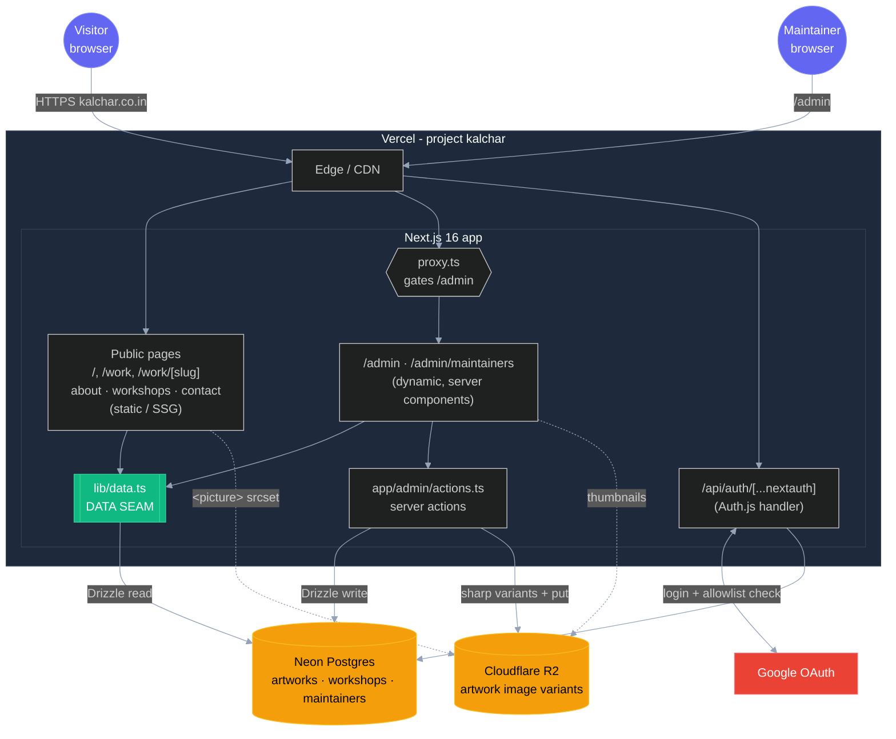
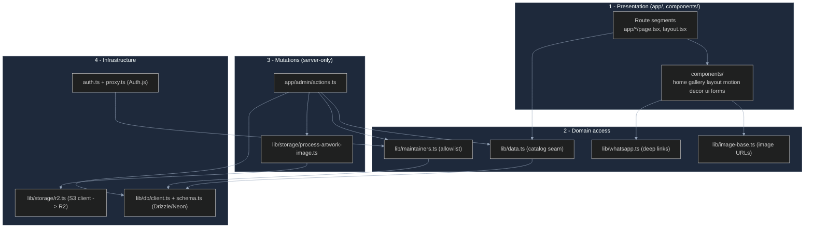
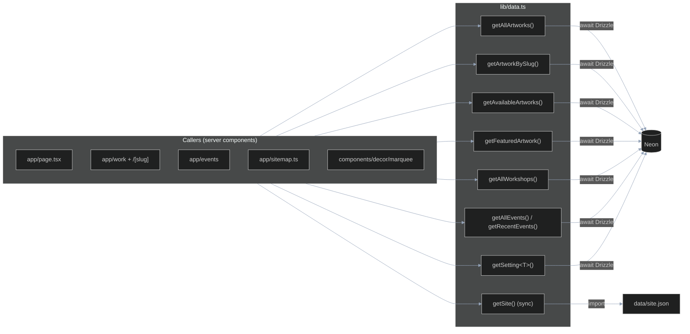

# System Architecture

How [kalchar.co.in](https://kalchar.co.in/) is built and runs. This is the entry point; deeper topics live in [DATABASE.md](DATABASE.md), [AUTH.md](AUTH.md), [IMAGES.md](IMAGES.md), [DEPLOYMENT.md](DEPLOYMENT.md), and [DEVELOPMENT.md](DEVELOPMENT.md).

## Overview

Kalchar is the portfolio + lightweight storefront for folk artist Megha Seth. Visitors browse a gallery of artworks (Madhubani, Pichwai, Lippan, Gond, texture work), see what's available to buy, and route purchase/commission intent to WhatsApp. A maintainer-only admin panel manages the catalog: upload images, set prices and availability, and add other maintainers.

It is a single Next.js 16 app, deployed on Vercel. Public pages are static/SSG (pre-rendered from the database at build time, served from the edge); the admin panel and auth endpoints are dynamic (server-rendered on demand). Catalog data lives in Neon Postgres, images in Cloudflare R2, and login is Google OAuth gated to a database allowlist.

## High-level architecture



## Stack

| Concern | Choice | Notes |
| --- | --- | --- |
| Framework | Next.js 16 App Router, React 19 | Hybrid: SSG public, dynamic admin |
| Language | TypeScript (strict) | |
| Styling | Tailwind 4, shadcn-style (cva + Radix) | tokens in `app/globals.css` |
| Animation | Motion 12 + Lenis (lazy) | all reduced-motion safe |
| Hosting | Vercel (`sagar-2` account) | `main` -> prod, `dev` -> preview |
| Database | Neon Postgres + Drizzle ORM | serverless, region in `DATABASE_URL` |
| Image storage | Cloudflare R2 (S3 API) | free egress, public bucket URL |
| Auth | Auth.js v5 + Google OAuth | allowlist in `maintainers` table |
| Tooling | Biome 2, pnpm 10, Node 22 | |

## Application layers



| Layer | Responsibility | Key files |
| --- | --- | --- |
| **Presentation** | Routes, React components, all rendering. Public pages are async server components that read the seam; admin pages add client islands for interactivity. | `app/`, `components/` |
| **Domain access** | The read API the UI depends on. `lib/data.ts` is the only place the catalog is read; `getSite()` reads `data/site.json` (static chrome). | `lib/data.ts`, `lib/maintainers.ts`, `lib/image-base.ts`, `lib/whatsapp.ts` |
| **Mutations** | Write paths, server-only, each re-checking auth. Catalog CRUD + events + profile settings + maintainer roster + image processing. | `app/admin/actions.ts`, `app/admin/event-actions.ts`, `lib/storage/process-artwork-image.ts` |
| **Infrastructure** | The external systems: Postgres via Drizzle, R2 via the S3 SDK, Auth.js session/OAuth. | `lib/db/`, `lib/storage/r2.ts`, `auth.ts`, `proxy.ts` |

## The data seam

[lib/data.ts](../lib/data.ts) is the single chokepoint for catalog reads, and the reason swapping the entire backend (JSON files -> Postgres, local images -> R2) touched almost no UI code.



- Catalog getters are **async** and query Neon via Drizzle. Rows are mapped to the UI `Artwork`/`Workshop` types (nullable DB columns -> optional fields; `palette` jsonb -> `string[]`).
- `getSite()` stays **synchronous** -- site brand/nav/contact/section copy is static chrome, read from `data/site.json`, and `app/layout.tsx` consumes it at module top-level where `await` can't reach.
- Rule: never query the DB or import `data/*.json` outside this file.

See [DATABASE.md](DATABASE.md) for the schema and query details.

## Rendering model

Public pages are **statically generated** -- at build time, `generateStaticParams` and the page bodies call the seam, read Neon, and bake HTML. Visitors hit the Vercel edge cache with no DB round-trip. When a maintainer changes data, the relevant server action calls `revalidatePath` to regenerate the affected pages.

`/admin`, `/admin/maintainers`, and `/api/auth/*` are **dynamic** -- server-rendered per request, behind the auth proxy.

```text
○  (Static)   /, /about, /contact, /custom-orders, /workshops, /work, sitemap
●  (SSG)      /work/[slug]  (one page per artwork slug, from the DB)
ƒ  (Dynamic)  /admin, /admin/maintainers, /api/auth/[...nextauth], proxy
```

## Request lifecycles

**Visitor views the gallery** -> edge serves the pre-rendered page -> each artwork `<picture>` srcset resolves to the R2 public URL ([lib/image-base.ts](../lib/image-base.ts)) -> images stream from Cloudflare's CDN. No server/DB at request time.

**Maintainer signs in** -> [proxy.ts](../proxy.ts) catches an unauthenticated `/admin` request -> redirects to Google via [`/api/auth`](../app/api/auth/[...nextauth]/route.ts) -> the `signIn` callback ([auth.ts](../auth.ts)) checks the email against the `maintainers` table -> only listed emails get a session. Full sequence in [AUTH.md](AUTH.md).

**Maintainer uploads a piece** -> [app/admin/actions.ts](../app/admin/actions.ts) `createArtwork` re-checks the session -> [process-artwork-image.ts](../lib/storage/process-artwork-image.ts) runs sharp to make AVIF/WebP/JPG at 4 widths -> uploads to R2 -> inserts the row in Neon -> `revalidatePath` refreshes public pages. Full pipeline in [IMAGES.md](IMAGES.md).

## Repository map

```text
app/                      routes (public SSG + /admin dynamic + /api/auth)
components/               home/ gallery/ events/ about/ layout/ motion/ decor/ ui/ forms/
auth.ts, proxy.ts         Auth.js config + /admin gate
lib/
  data.ts                 the catalog seam
  db/                     schema.ts (7 tables) + client.ts (neon-http + Drizzle)
  storage/                r2.ts + process-artwork-image.ts
  maintainers.ts          admin allowlist
  image-base.ts           R2 image URL base
  types.ts whatsapp.ts site-config.ts hooks/
data/
  site.json               brand/nav/copy (runtime)
  artworks.json           original seed source
public/artworks/          master JPGs (R2 regenerate source, not served at runtime)
scripts/
  migrate-json-to-db.ts   pnpm db:seed
  migrate-images-to-r2.ts pnpm db:images
drizzle.config.ts
docs/                     this suite
```
