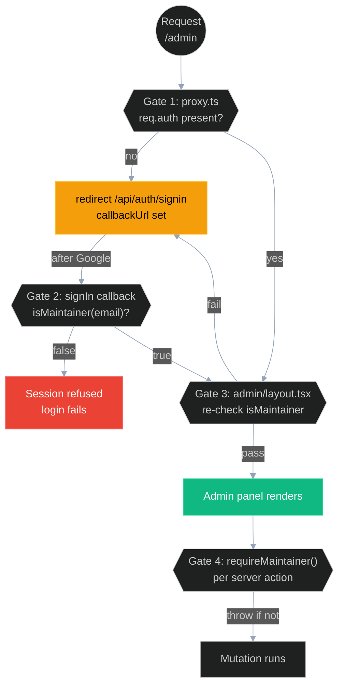
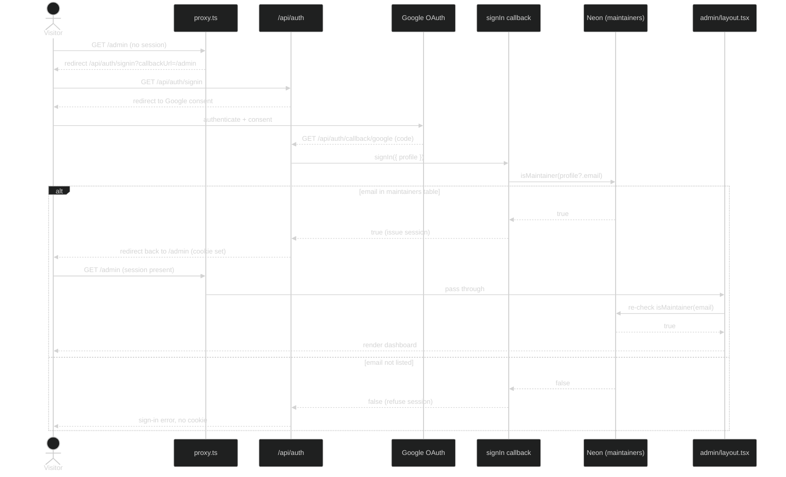
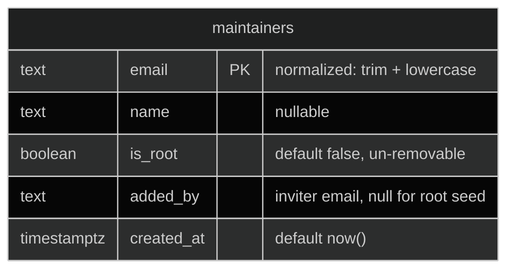
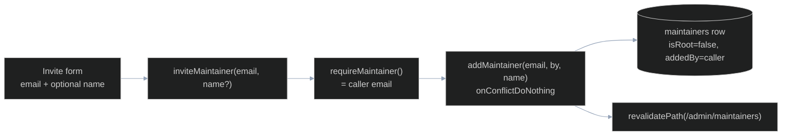

# Authentication and Authorization

How the `/admin` panel is locked down. Login is Auth.js v5 with the Google provider only, and access is gated to a database-backed allowlist (the `maintainers` table) rather than a static env var, so the roster changes without a redeploy. This doc covers the two-gate model, the sign-in flow, the maintainer roster API, and OAuth configuration. For the wider system picture start at [ARCHITECTURE.md](ARCHITECTURE.md); the schema lives in [DATABASE.md](DATABASE.md) and env/OAuth provisioning in [DEPLOYMENT.md](DEPLOYMENT.md).

## Overview

Auth is configured once in [auth.ts](../auth.ts) via `NextAuth({ ... })`, which exports four values used everywhere else:

| Export | Used by | Purpose |
| --- | --- | --- |
| `handlers` (`GET`, `POST`) | [app/api/auth/[...nextauth]/route.ts](../app/api/auth/[...nextauth]/route.ts) | The `/api/auth/*` endpoints (sign-in, callback, sign-out) |
| `auth` | [proxy.ts](../proxy.ts), `app/admin/layout.tsx`, `app/admin/_helpers.ts` | Read the current session server-side |
| `signOut` | [app/admin/layout.tsx](../app/admin/layout.tsx) | The "Sign out" form action |
| `signIn` | (available; flow uses the `/api/auth/signin` redirect directly) | Programmatic sign-in |

Provider config is deliberately minimal:

```ts
export const { handlers, signIn, signOut, auth } = NextAuth({
  providers: [Google],
  callbacks: {
    async signIn({ profile }) {
      const email = profile?.email;
      if (!email) return false;
      return await isMaintainer(email);
    },
  },
});
```

Two things to note. First, Google is the only provider -- there is no email/password or other OAuth. Second, no `clientId`/`clientSecret` is wired into the `Google` provider: Auth.js v5 auto-reads `AUTH_GOOGLE_ID` and `AUTH_GOOGLE_SECRET` from the environment, and `AUTH_SECRET` signs the session cookie. That keeps secrets out of source (auth.ts:11-13 documents this).

The authorization decision is the `signIn` callback at auth.ts:21-23. It does not consult an env var or hardcoded list. It calls `isMaintainer(profile?.email)` ([lib/maintainers.ts](../lib/maintainers.ts)), which queries Neon. A Google account that is not in the table can complete Google's OAuth dance but is refused a session.

## The two gates

Access control is layered. A request to `/admin` passes through up to four checks, and the allowlist is enforced more than once on purpose (defense in depth).



**Gate 1 -- "must be logged in" (the proxy).** [proxy.ts](../proxy.ts) wraps the request with `auth((req) => ...)`. Its `config.matcher` is `["/admin/:path*"]`, so it runs on every admin path. If the path starts with `/admin` and `req.auth` is absent, it builds a redirect to `/api/auth/signin` and pins the original path as `callbackUrl` (proxy.ts:14-22):

```ts
const isAdmin = req.nextUrl.pathname.startsWith("/admin");
if (isAdmin && !req.auth) {
  const signInUrl = new URL("/api/auth/signin", req.nextUrl.origin);
  signInUrl.searchParams.set("callbackUrl", req.nextUrl.pathname);
  return NextResponse.redirect(signInUrl);
}
```

Middleware checks only *that* a session exists. It does **not** consult the allowlist. Whether the logged-in person is actually a maintainer is decided at login (Gate 2).

**Gate 2 -- "must be a maintainer" (signIn callback).** The `signIn` callback in [auth.ts](../auth.ts) returns the boolean from `isMaintainer(profile?.email)`. Auth.js treats a falsy return as "deny": a non-listed Google account authenticates with Google but is denied a session, so it never gets the cookie that satisfies Gate 1. This is the single point where the allowlist becomes a hard wall.

**Gate 3 -- defense in depth (admin layout).** [app/admin/layout.tsx](../app/admin/layout.tsx) is a server component that runs on every admin render. It reads the session and re-checks the allowlist, redirecting to sign-in if either is missing (app/admin/layout.tsx:16-18):

```ts
const session = await auth();
const email = session?.user?.email;
if (!email || !(await isMaintainer(email))) redirect("/api/auth/signin?callbackUrl=/admin");
```

Gate 2 should already guarantee this, but the layout never trusts that assumption. The layout also sets `robots: { index: false, follow: false }` (`export const metadata` in app/admin/layout.tsx:13) so the admin shell stays out of search indexes.

**Gate 4 -- per-mutation (server actions).** [app/admin/_helpers.ts](../app/admin/_helpers.ts) defines `requireMaintainer()`, and every exported action in both action modules ([actions.ts](../app/admin/actions.ts) for the catalog/roster, [event-actions.ts](../app/admin/event-actions.ts) for events + profile settings) calls it before touching the database or R2:

```ts
async function requireMaintainer(): Promise<string> {
  const session = await auth();
  const email = session?.user?.email;
  if (!email || !(await isMaintainer(email))) {
    throw new Error("Not authorized.");
  }
  return email.toLowerCase();
}
```

Server actions are POST endpoints that can be invoked directly, bypassing the proxy, so each one re-verifies independently. It returns the lowercased caller email, which the roster actions reuse as `addedBy` (see below).

| Gate | File | Enforces | Allowlist checked? |
| --- | --- | --- | --- |
| 1 | `proxy.ts` | Session exists for `/admin/*` | No |
| 2 | `auth.ts` `signIn` callback | Email is a maintainer (at login) | Yes |
| 3 | `app/admin/layout.tsx` | Session + maintainer (per render) | Yes |
| 4 | `app/admin/_helpers.ts` `requireMaintainer` (used by actions.ts + event-actions.ts) | Session + maintainer (per mutation) | Yes |

## Sign-in flow

The first request to `/admin` by an unauthenticated visitor walks the full round trip: proxy redirect, Google consent, callback, the `signIn` decision, then back to `/admin` where the layout re-checks before rendering.



Notes:

- The Google callback URL is fixed at `/api/auth/callback/google` (documented at route.ts:3) and must be registered in the Google Cloud OAuth client -- see [Configuration](#configuration).
- Gate 1 lives in [proxy.ts](../proxy.ts) -- Next 16's rename of `middleware.ts`. The Auth.js `auth()` wrapper supplies the default export Next runs as the proxy; it runs on the Node.js runtime.
- `callbackUrl` survives the round trip, so a maintainer who deep-links to `/admin/maintainers` lands back there after login rather than at `/admin`.

## The maintainer roster

The allowlist is the `maintainers` table in [lib/db/schema.ts](../lib/db/schema.ts). It replaces what would otherwise be a static `ADMIN_EMAILS` env var, so a logged-in maintainer can grow or shrink the roster from the panel with no redeploy.



| Column | Type | Notes |
| --- | --- | --- |
| `email` | `text` PK | Primary key; stored normalized (lowercased, trimmed) |
| `name` | `text` (nullable) | Optional display name |
| `isRoot` | `boolean`, default `false` | Marks the bootstrap maintainer; protected from removal |
| `addedBy` | `text` (nullable) | Email of the inviter; `null` for the root seed |
| `createdAt` | `timestamptz`, default `now()` | Used as the secondary sort key |

The root row is `sg85207@gmail.com`, seeded at migration time with `isRoot = true` and un-removable. Because at least one root always survives, the panel can never delete its way into a lockout (schema.ts:60-69).

### lib/maintainers.ts API

All four functions are server-only (they touch the DB) and route every email through `normalize()` (lib/maintainers.ts:15-17), which is `email.trim().toLowerCase()`. Normalization on both write and lookup means casing or stray whitespace never produces a duplicate row or a missed match.

| Function | Signature | Behavior |
| --- | --- | --- |
| `isMaintainer` | `(email: string \| null \| undefined) => Promise<boolean>` | Returns `false` for a null/empty email; otherwise selects one row where `email = normalize(email)` and returns whether a row exists. This is the function both the `signIn` callback and `requireMaintainer()` call. |
| `listMaintainers` | `() => Promise<readonly MaintainerRow[]>` | Selects all rows and sorts in memory: root rows first, then by `createdAt` ascending (lib/maintainers.ts:31-38). |
| `addMaintainer` | `(email, addedBy, name?) => Promise<void>` | Inserts a row with `isRoot: false`, normalized `email` and `addedBy`. Idempotent via `onConflictDoNothing({ target: maintainers.email })` -- inviting an existing email is a silent no-op. |
| `removeMaintainer` | `(email) => Promise<boolean>` | Looks the row up; returns `false` if absent. **Throws `"Cannot remove a root maintainer."` if `isRoot`** (the lockout guard). Otherwise deletes and returns `true`. |

The lockout guard lives at lib/maintainers.ts:62: `if (row.isRoot) throw new Error("Cannot remove a root maintainer.")`. It is the database-level backstop that pairs with the UI hiding the remove button for root rows.

### Page and server actions

[app/admin/maintainers/page.tsx](../app/admin/maintainers/page.tsx) is a server component. It fetches the roster and session in parallel (`Promise.all([listMaintainers(), auth()])`), then passes a trimmed roster view plus the current user's lowercased email (`me`) to the `MaintainerManager` client component. The page never calls the mutation functions directly -- those go through server actions:

- `inviteMaintainer(email, name?)` -- calls `requireMaintainer()` (capturing the caller as `by`), then `addMaintainer(email, by, name)`, then `revalidatePath("/admin/maintainers")` (actions.ts:145-149). The caller email becomes the new row's `addedBy`.
- `revokeMaintainer(email)` -- calls `requireMaintainer()`, then `removeMaintainer(email)` (which throws if the target is root), then revalidates (actions.ts:151-155).

The client component (`MaintainerManager`) wraps both in a `useTransition` and surfaces any thrown error message inline, so the root-removal rejection shows up as visible text rather than a crash. It also hides the Remove button entirely for `isRoot` rows and shows a "root" badge instead, and `confirm()`s before revoking.



A newly invited person gets access the next time they sign in: their email is now in the table, so Gate 2 returns `true`. There is no email invitation sent -- "invite" here means "add to the allowlist".

## Configuration

### Environment variables

Three secrets drive auth (the contract is in [.env.example](../.env.example), filled in `.env.local` locally and as Vercel env vars in prod/preview):

| Var | Source | Purpose |
| --- | --- | --- |
| `AUTH_SECRET` | `npx auth secret` | Signs/encrypts the session cookie |
| `AUTH_GOOGLE_ID` | Google Cloud OAuth client | Auto-read by the `Google` provider |
| `AUTH_GOOGLE_SECRET` | Google Cloud OAuth client | Auto-read by the `Google` provider |

The allowlist is deliberately **not** an env var -- it is the `maintainers` table, seeded with `sg85207@gmail.com` as root (.env.example:10-12).

### Google OAuth client setup

In the Google Cloud Console, create an OAuth 2.0 client (Web application) and configure two lists:

1. **Authorized JavaScript origins** -- the bare domain(s) the app runs on, for example `https://kalchar.co.in` and the relevant Vercel preview origin.
2. **Authorized redirect URIs** -- the full callback path `/api/auth/callback/google` for **every** deploy origin that signs users in:
   - `https://kalchar.co.in/api/auth/callback/google` (production)
   - `https://<preview>.vercel.app/api/auth/callback/google` (Vercel preview)
   - `http://localhost:3000/api/auth/callback/google` (local dev)

The classic failure is `redirect_uri_mismatch`: Google refuses the callback because the deploy URL hitting it is not in the Authorized redirect URIs list. When a new preview/prod origin starts serving `/admin`, add its callback URL here first. Where these secrets and OAuth settings are provisioned per environment is covered in [DEPLOYMENT.md](DEPLOYMENT.md).
