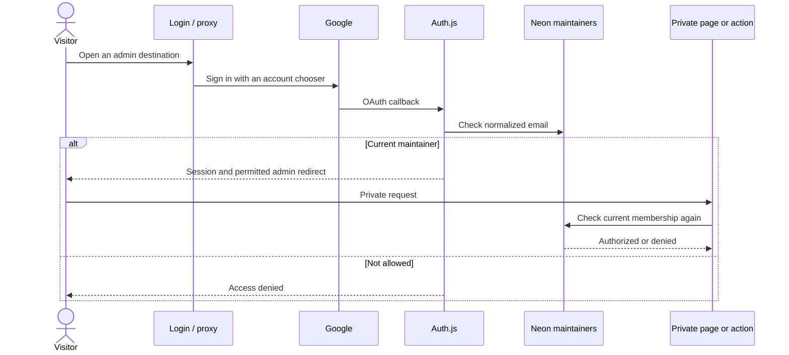

# Authentication and private access

Google OAuth through Auth.js identifies a visitor. Current membership in the Postgres `maintainers` table authorizes admin access. The two decisions are separate: a session cookie can survive a roster removal, so private reads and writes re-check the roster. Start at [ARCHITECTURE.md](ARCHITECTURE.md) for the system and [DATABASE.md](DATABASE.md) for the schema.

## Access boundaries

| Boundary | Responsibility |
| --- | --- |
| [proxy.ts](../proxy.ts) | Route signed-out admin requests to login. It is not the only protection for server actions or private reads. |
| [auth.ts](../auth.ts) | Google-only sign-in, account chooser, and allowlist lookup before issuing a session. |
| [lib/admin-auth.ts](../lib/admin-auth.ts) | `getAdminAccess` resolves the session and current membership, cached within one request. `requireAdminPage` redirects denied requests before page reads; `requireMaintainer` rejects unauthorized private operations. |
| [lib/data.ts](../lib/data.ts) | Private lead and maintainer accessors guard their own reads. Public catalog accessors do not expose those private collections. |
| `app/admin/*-actions.ts` and `actions.ts` | Each management mutation re-checks current membership before touching Neon or R2. |
| [app/admin/layout.tsx](../app/admin/layout.tsx) | Guard the admin shell and keep it out of search indexes. A reusable layout is not a substitute for page/data authorization. |

Request caching is not a cross-request permission cache. A later action or navigation must read current membership again. Direct calls to private data accessors and server actions must remain protected even if no layout is rendered.

The separate public lead submission action accepts visitor inquiries with validation, a honeypot, and rate limiting. It does not grant access to the private lead queue.

## Sign-in, callbacks, and revocation


```mermaid
sequenceDiagram
    actor Visitor
    participant Login as Login / proxy
    participant Google
    participant Auth as Auth.js
    participant Roster as Neon maintainers
    participant Admin as Private page or action
    Visitor->>Login: Open an admin destination
    Login->>Google: Sign in with an account chooser
    Google->>Auth: OAuth callback
    Auth->>Roster: Check normalized email
    alt Current maintainer
        Auth-->>Visitor: Session and permitted admin redirect
        Visitor->>Admin: Private request
        Admin->>Roster: Check current membership again
        Roster-->>Admin: Authorized or denied
    else Not allowed
        Auth-->>Visitor: Access denied
    end
```

[lib/admin-callback.ts](../lib/admin-callback.ts) limits post-login destinations to local `/admin` paths at the configured site origin. It rejects backslashes, control/space characters, external origins, non-admin paths, and encoded path separators. Invalid values fall back to `/admin`.

The login page does not send every existing session back to admin blindly. A signed-in person removed from the allowlist goes to `/access-denied`; that page offers an explicit sign-out/account-change action. This prevents an admin/login redirect loop.

Removing a maintainer takes effect on subsequent guarded requests even when their old session cookie remains valid. Already-rendered information in an open browser cannot be recalled; authorization prevents later private reads and changes. Test this boundary with mocked or isolated accounts, never by minting sessions for real users.

`KALCHAR_TEST_FIXTURES=1` supplies public content only. It makes maintainer admission fail and database-object access throw, and it rejects `VERCEL=1`. It is not an admin test bypass. The explicit `KALCHAR_ADMIN_PREVIEW=1` flag (`pnpm dev:preview`) is the one local exception: it only works inside fixture mode, renders the admin as the synthetic `preview@kalchar.invalid` for design review, grants nothing to any real account, and cannot write anywhere because the database proxy and the R2 client both throw. `lib/env.ts` refuses it on Vercel.

## Maintainer roster and first root

Emails are trimmed and lowercased. The admin interface can add or remove maintainers; adding an email changes the allowlist but sends no email invitation. `is_root` protects a bootstrap account from removal through the application. `added_by` records the caller who added a maintainer and is a soft audit reference, not a foreign key.

Catalog seeding and numbered schema migrations do not create the first root account. After migrations, an authorized operator must provision the approved Google email in a new environment. Keep that email out of committed migration files.

For an empty isolated roster, use the provider SQL editor or an externally configured libpq service. A `psql` session can use a named variable set interactively, then the following transaction:

```sql
BEGIN;
LOCK TABLE public.maintainers IN SHARE ROW EXCLUSIVE MODE;
INSERT INTO public.maintainers (email, is_root)
SELECT lower(trim(:'root_email')), true
WHERE NOT EXISTS (SELECT 1 FROM public.maintainers);
COMMIT;
```

Set `root_email` to the approved Google account before running this SQL. Verify exactly one intended root was inserted. The statement deliberately does nothing once any roster row exists; changing ownership of an existing environment is a separate reviewed operation. This documentation does not claim a live root was provisioned.

The application root-removal guard is application logic, not a database privilege boundary against administrators with direct SQL access. Give application and operator credentials only the privileges their roles require.

## Configuration

| Variable | Purpose |
| --- | --- |
| `AUTH_SECRET` | Session encryption/signing secret, stored only in the approved secret store or gitignored local environment. |
| `AUTH_GOOGLE_ID` | Google OAuth client identifier, consumed by the Auth.js provider. |
| `AUTH_GOOGLE_SECRET` | Google OAuth client secret. |
| `DATABASE_URL` | The environment's allowlist/catalog database. |

Configure the Google Web application client with exact JavaScript origins and callback URLs for each environment that needs sign-in. The callback path is `/api/auth/callback/google`; examples include production and each explicitly allowed local/preview origin. A different port or preview hostname needs its own matching callback entry. Do not broaden access simply to make a mismatch disappear.

Auth.js trusts the deployed host in the existing configuration. Keep deployments behind their intended Vercel/local host boundaries and provision production and preview credentials/resources separately. Provider client settings, secret rotation, live revocation, and sign-in were not exercised by the offline repository checks; record those checks in the relevant deployment or restore drill.
