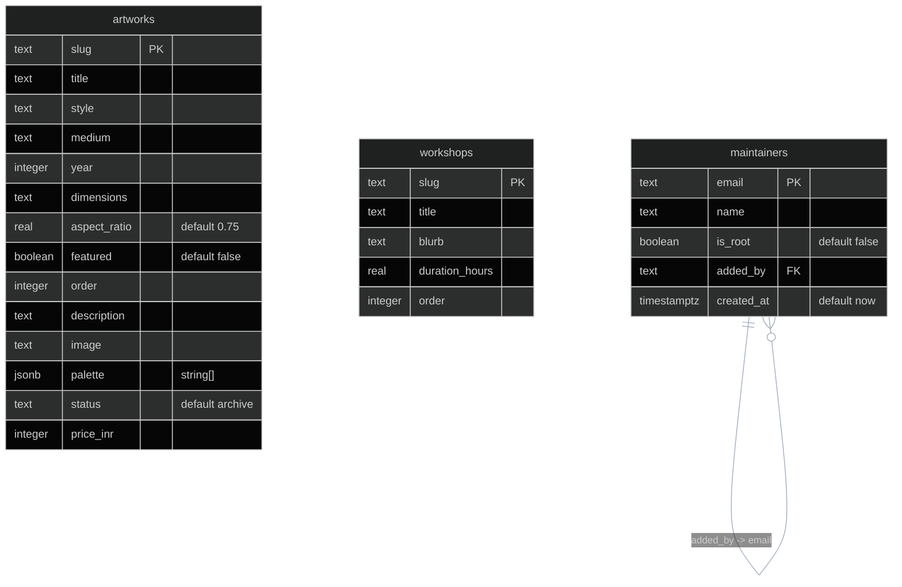
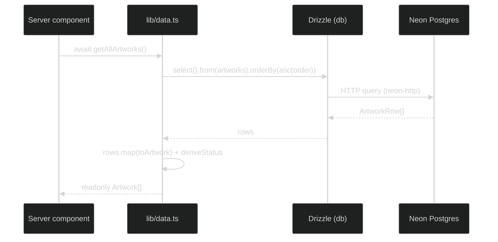
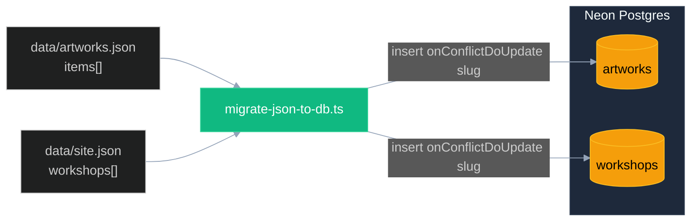

# Database

The catalog (artworks, workshops) and the admin allowlist (maintainers) live in Neon serverless Postgres, accessed through Drizzle ORM. This doc covers the connection, the three-table schema, the read seam in [lib/data.ts](../lib/data.ts), the write path in [app/admin/actions.ts](../app/admin/actions.ts), and the migration/seed commands. Start at [ARCHITECTURE.md](ARCHITECTURE.md) for the whole-system picture; the auth re-check on writes is in [AUTH.md](AUTH.md) and the image side of catalog writes is in [IMAGES.md](IMAGES.md).

## Overview

| Concern | Choice | Where |
| --- | --- | --- |
| Database | Neon serverless Postgres | region set in the Neon console, encoded in `DATABASE_URL` |
| ORM | Drizzle | [lib/db/schema.ts](../lib/db/schema.ts), [lib/db/client.ts](../lib/db/client.ts) |
| Driver | `@neondatabase/serverless` neon-http | `lib/db/client.ts:12` |
| Connection | module-level singleton `db` | `lib/db/client.ts:24` |
| Credentials | `DATABASE_URL` env | `.env.example`, `.env.local` |
| Migrations | Drizzle Kit (`postgresql` dialect) | [drizzle.config.ts](../drizzle.config.ts) |

Postgres was chosen to match the ledger-sync app, so both repos share one DB provider and reuse the same Neon + Vercel integration (`lib/db/schema.ts:4`). Because Postgres has a native `jsonb` column, the `palette` array is stored structured rather than as a serialized string (`lib/db/schema.ts:9`).

[lib/db/client.ts](../lib/db/client.ts) builds the client once at module load:

```ts
const url = process.env.DATABASE_URL;
if (!url) {
  throw new Error("DATABASE_URL is not set. See .env.example and docs/DATABASE.md.");
}
const sql = neon(url);
export const db = drizzle({ client: sql, schema });
```

It uses the **neon-http** driver on purpose: it is the fastest path for single, non-interactive queries, which is exactly the gallery's read pattern (one `select` per getter, no transactions, no session state). The module-level singleton is safe on serverless because each warm Lambda/edge instance reuses the one client (`lib/db/client.ts:8`). The file is imported only by [lib/data.ts](../lib/data.ts) and the server-side scripts; never from a client component, since the connection string holds credentials.

## Schema

Three tables, all defined in [lib/db/schema.ts](../lib/db/schema.ts). `artworks` and `workshops` are independent (each keyed by `slug`); `maintainers` has a soft self-reference where `addedBy` points at the `email` of the maintainer who added the row (nullable for the root seed, never enforced as an FK).



### artworks

The catalog. One row per piece, keyed by `slug`. Mirrors the `Artwork` interface in [lib/types.ts](../lib/types.ts).

| Column | pg type | Null / default | Meaning |
| --- | --- | --- | --- |
| `slug` | `text` | PK, not null | Stable id and URL segment (`/work/[slug]`). |
| `title` | `text` | not null | Display title. |
| `style` | `text` | not null | Art style; UI narrows to the `ArtStyle` union (Madhubani, Pichwai, Lippan, Gond, Texture, Mixed Media). |
| `medium` | `text` | not null | Material/technique line. |
| `year` | `integer` | nullable | Year made. |
| `dimensions` | `text` | nullable | Free-text size, e.g. `30 x 40 cm`. |
| `aspect_ratio` | `real` | not null, default `0.75` | width / height, used for gallery layout decisions. |
| `featured` | `boolean` | not null, default `false` | Hero/rail inclusion. |
| `order` | `integer` | not null | Sort key, ascending. Lower sorts earlier. |
| `description` | `text` | nullable | Long copy for the detail page. |
| `image` | `text` | not null | Image identifier. Phase 2: the `<slug>.jpg` key resolved against the R2 public base via [lib/image-base.ts](../lib/image-base.ts). |
| `palette` | `jsonb` (`string[]`) | nullable | Sampled palette of 3-5 hex values for chromacard / accent UI. |
| `status` | `text` | not null, default `archive` | Lifecycle: `archive` / `available` / `sold`. |
| `price_inr` | `integer` | nullable | Price in INR. When set, the piece is considered for-sale. |

### workshops

The teaching offerings. One row per workshop, keyed by `slug`. Mirrors the `Workshop` interface in [lib/types.ts](../lib/types.ts).

| Column | pg type | Null / default | Meaning |
| --- | --- | --- | --- |
| `slug` | `text` | PK, not null | Stable id. |
| `title` | `text` | not null | Workshop title. |
| `blurb` | `text` | not null | Short description. |
| `duration_hours` | `real` | nullable | Length in hours. |
| `order` | `integer` | not null | Sort key, ascending. |

### maintainers

The admin allowlist. Replaces a static `ADMIN_EMAILS` env var so a logged-in maintainer can add or remove others from the panel without a redeploy (`lib/db/schema.ts:53`). The Auth.js `signIn` callback checks an email against this table; see [AUTH.md](AUTH.md).

| Column | pg type | Null / default | Meaning |
| --- | --- | --- | --- |
| `email` | `text` | PK, not null | Lowercased Google account email. |
| `name` | `text` | nullable | Display name. |
| `is_root` | `boolean` | not null, default `false` | True for the seeded bootstrap maintainer (`sg85207@gmail.com`); root rows cannot be removed, so the panel can never delete its way into a lockout. |
| `added_by` | `text` | nullable | Email of the maintainer who added this one; null for the root seed. Soft self-reference into `email`. |
| `created_at` | `timestamptz` | not null, default `now()` | Insert time, timezone-aware. |

Drizzle infers select/insert types off these tables: `ArtworkRow`/`ArtworkInsert`, `WorkshopRow`/`WorkshopInsert`, `MaintainerRow`/`MaintainerInsert` (`lib/db/schema.ts:71`).

## The data seam

[lib/data.ts](../lib/data.ts) is the single read chokepoint for the catalog. Everything in `app/` and `components/` reads artworks and workshops through it; nothing else queries Neon or imports `data/*.json` directly. This seam is why moving the backend from JSON files to Postgres touched almost no UI code -- the returned `Artwork[]` / `Workshop[]` shapes never changed. See [ARCHITECTURE.md](ARCHITECTURE.md) for the seam in context.

### Getters

| Function | Sync/async | Source | Returns |
| --- | --- | --- | --- |
| `getAllArtworks()` | async | `select ... orderBy order asc` | `readonly Artwork[]` |
| `getAvailableArtworks()` | async | filters `getAllArtworks()` | `status === "available"` only |
| `getFeaturedArtwork()` | async | `getAllArtworks()` | first `featured`, else lowest-order fallback |
| `getArtworkBySlug(slug)` | async | `getAllArtworks()` | one `Artwork \| undefined` |
| `getAllArtworkSlugs()` | async | `getAllArtworks()` | `readonly string[]` for `generateStaticParams` |
| `getAllWorkshops()` | async | `select ... orderBy order asc` | `readonly Workshop[]` |
| `getSite()` | **sync** | `data/site.json` | `Site` (static chrome) |

Only `getAllArtworks` and `getAllWorkshops` hit the DB directly (`lib/data.ts:69`, `lib/data.ts:96`); the available/featured/by-slug/slugs getters all derive from the in-memory `getAllArtworks()` result. `getSite()` stays synchronous because brand/nav/contact/section copy is static chrome read from `data/site.json`, and `app/layout.tsx` consumes it at module top-level where `await` cannot reach (`lib/data.ts:101`).

### Row to UI mapping

`toArtwork` and `toWorkshop` map a DB row to the UI type, collapsing nullable columns to optional fields and reading the `palette` jsonb straight into a `string[]` (`lib/data.ts:39`, `lib/data.ts:58`). For example `year: row.year ?? undefined`, `palette: row.palette ?? undefined`.

`deriveStatus` is the one non-trivial mapping. The DB stores `status` explicitly (default `archive`), but the seam keeps a Phase 1 fallback so a row left at the default still flips to `available` the moment a price is set -- no extra admin step (`lib/data.ts:25`):

```ts
function deriveStatus(row: ArtworkRow): ArtworkStatus {
  if (row.status === "available" || row.status === "sold" || row.status === "archive") {
    if (row.status === "archive" && typeof row.priceInr === "number") return "available";
    return row.status;
  }
  return typeof row.priceInr === "number" ? "available" : "archive";
}
```

Read it as: a stored status of `available` or `sold` wins as-is; a stored `archive` with a numeric `priceInr` resolves to `available`; an `archive` with no price stays `archive`. The final branch is the legacy fallback for any unrecognized/absent status, deriving purely from price presence.

### Read flow



Under SSG these getters run at build time and bake into HTML; the same functions serve dynamic requests for the admin panel. No DB round-trip happens when a visitor hits a pre-rendered public page.

## Writes

Catalog mutations live in [app/admin/actions.ts](../app/admin/actions.ts) as server actions. Each one calls `requireMaintainer()` first (defense in depth -- the proxy already gates `/admin`, but actions can be invoked directly), then mutates rows, then calls `revalidateCatalog(slug)` to refresh the affected paths (`/`, `/work`, `/admin`, and `/work/${slug}`). The auth re-check is detailed in [AUTH.md](AUTH.md); the R2 image side in [IMAGES.md](IMAGES.md).

| Action | DB effect | Notes |
| --- | --- | --- |
| `setPrice(slug, priceInr)` | `update` price + status | `setPrice(null)` clears the price and sets `status` to `archive` (`app/admin/actions.ts:45`). |
| `setStatus(slug, status)` | `update` status | Explicit `archive` / `available` / `sold`. |
| `setFeatured(slug, featured)` | `update` featured | Toggles hero/rail inclusion. |
| `updateArtworkMeta(slug, fields)` | `update` free-text fields | `title`, `description`, `medium`, `dimensions`, `year`. |
| `createArtwork(formData)` | `insert` new row | Slugifies the title, processes the image, computes `order`. |
| `deleteArtwork(slug)` | `delete` row + R2 variants | Deletes the row, then `deleteArtworkImages(slug)`. |

`createArtwork` does the most work: it slugifies the title via `slugify()` (lowercase, non-alphanumeric runs to `-`, trimmed) (`app/admin/actions.ts:29`), rejects a duplicate slug, runs `processArtworkImage` to derive `aspectRatio`, computes the next sort key as `max(order) + 1` over all rows (`app/admin/actions.ts:113`), and sets `status` to `available` when a valid price is provided, else `archive`. The maintainer-roster actions (`inviteMaintainer`, `revokeMaintainer`) go through [lib/maintainers.ts](../lib/maintainers.ts) rather than touching `artworks`.

## Migrations and commands

Drizzle Kit drives schema changes. [drizzle.config.ts](../drizzle.config.ts) points at `./lib/db/schema.ts`, emits SQL to `./drizzle`, and uses the `postgresql` dialect. It loads `.env.local` explicitly via `dotenv` because drizzle-kit does not read it automatically the way Next.js does (`drizzle.config.ts:13`):

```ts
config({ path: ".env.local" }); // drizzle-kit does not auto-load .env.local
```

```sh
pnpm db:push       # drizzle-kit push: push schema straight to the DB (rapid dev)
pnpm db:generate   # drizzle-kit generate: emit SQL migration files under ./drizzle
pnpm db:migrate    # drizzle-kit migrate: apply the generated migrations
pnpm db:seed       # tsx scripts/migrate-json-to-db.ts: JSON -> Neon rows
pnpm db:images     # tsx scripts/migrate-images-to-r2.ts: upload image variants (see IMAGES.md)
```

Use `db:push` for rapid local iteration on the schema; use `db:generate` + `db:migrate` when you want versioned SQL files committed under `./drizzle`.

### Seeding

`pnpm db:seed` runs [scripts/migrate-json-to-db.ts](../scripts/migrate-json-to-db.ts) once the tables exist (after `db:push`). `DATABASE_URL` reaches the script via `tsx --env-file=.env.local` (`scripts/migrate-json-to-db.ts:16`). It seeds:

- **artworks** from `data/artworks.json` (`items` array).
- **workshops** from `data/site.json` (`workshops` array).

It is idempotent: each insert uses `onConflictDoUpdate` keyed on `slug`, so re-running re-syncs the rows rather than duplicating them (`scripts/migrate-json-to-db.ts:51`, `scripts/migrate-json-to-db.ts:83`). The script seeds catalog metadata only; the `image` column keeps the `<slug>.jpg` filename, and uploading the actual image variants to R2 is the separate `pnpm db:images` step covered in [IMAGES.md](IMAGES.md). It carries its own local `deriveStatus` (a simpler variant: stored status wins, else price presence decides) so JSON rows without an explicit status seed correctly (`scripts/migrate-json-to-db.ts:23`).


