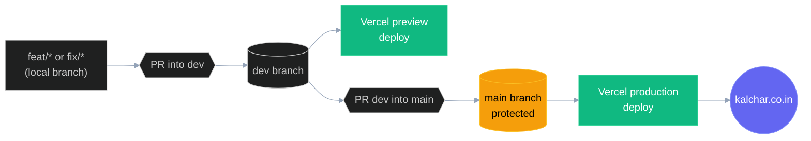
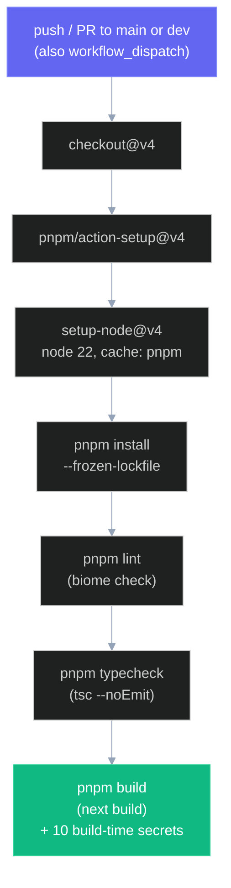
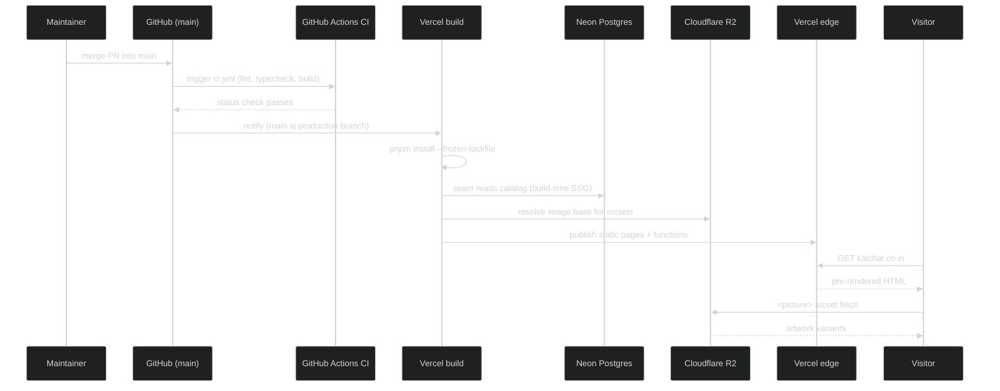

# Deployment

How [kalchar.co.in](https://kalchar.co.in/) ships: where it runs, how branches map to environments, what CI does, which secrets the build needs, and how DNS resolves. [ARCHITECTURE.md](ARCHITECTURE.md) is the entry point for the system as a whole; this doc covers only the path from a commit to live traffic. Sibling docs cover the secrets in depth: [DATABASE.md](DATABASE.md) for `DATABASE_URL`, [IMAGES.md](IMAGES.md) for the R2 vars, [AUTH.md](AUTH.md) for the Auth.js vars, and [DEVELOPMENT.md](DEVELOPMENT.md) for the local `.env.local` setup.

## Overview

One Next.js 16 app, hosted on Vercel under the `sagar-2` account, project `kalchar`. There is no separate frontend/backend deploy: the same app serves both. Public pages (`/`, `/work`, `/work/[slug]`, about, workshops, contact, sitemap) are static/SSG, pre-rendered at build time and served from the Vercel edge; `/admin`, `/admin/maintainers`, and `/api/auth/*` are dynamic, server-rendered per request. The rendering split is in [ARCHITECTURE.md](ARCHITECTURE.md#rendering-model).

The build command is plain `next build` ([package.json](../package.json) `scripts.build`). There is no static-export step and no sharp prebuild pipeline -- the earlier GitHub Pages era used `output: "export"` plus an image prebuild, both retired. [next.config.mjs](../next.config.mjs) sets `trailingSlash: true` (keeps the canonical `/work/` URL shape) and `images.unoptimized: true` (the gallery hand-rolls `<picture>` against R2 via [lib/image-base.ts](../lib/image-base.ts), so Next's image optimizer is off). Vercel auto-detects the Next.js framework preset; no `vercel.json` is needed.

| Concern | Value |
| --- | --- |
| Host | Vercel, account `sagar-2`, project `kalchar` |
| Production domain | `kalchar.co.in` (apex) |
| Production branch | `main` |
| Preview branch | `dev` |
| Build command | `next build` |
| Node | 22 (`engines.node` `>=22`) |
| Package manager | pnpm 10 (`packageManager` `pnpm@10.32.0`) |
| Output | Hybrid: static pages on edge cache + serverless functions for `/admin` and `/api` |

## Branch and deploy flow

Active work lands on `dev`, which is ahead of `main`. Feature branches (`fix/*`, `feat/*`) PR into `dev`; once `dev` is satisfactory, `dev` PRs into `main`. Merging to `main` triggers the Vercel production deploy to `kalchar.co.in`. `dev` deploys to a Vercel preview URL.

Only `main` and `dev` deploy. The Vercel project sets an **Ignored Build Step** (`commandForIgnoringBuildStep`) that exits non-zero -- skipping the build -- on every ref that is not `main` or `dev`. That is why bot branches (Renovate, ImgBot) no longer spin up deploys: their pushes land on their own branches, the ignore step short-circuits, and no preview is created. Previews exist for `dev` only, not for arbitrary feature branches.

Branch protection and git hygiene (from [CLAUDE.md](../CLAUDE.md) project rules):

- `main` is branch-protected: a PR and passing CI are required to merge. No direct pushes.
- Never force-push `main`. Never amend published commits. Never skip hooks (`--no-verify`).
- Never push to remote without explicit per-session approval. Rebasing local feature branches autonomously is fine.
- One open PR at a time per target. Bot PRs count.

## CI

[.github/workflows/ci.yml](../.github/workflows/ci.yml) runs on `pull_request` and `push` to `main` and `dev`, plus manual `workflow_dispatch`. Concurrency is keyed by workflow + ref (`group: ${{ github.workflow }}-${{ github.ref }}`, `cancel-in-progress: true`), so a newer push on the same ref cancels an in-flight run. One job, `build`, on `ubuntu-latest`, 10-minute timeout.

Steps, in order:

1. `actions/checkout@v4`.
2. `pnpm/action-setup@v4`.
3. `actions/setup-node@v4` with `node-version: 22` and `cache: pnpm`.
4. `pnpm install --frozen-lockfile` -- the lockfile must be in sync or the install fails.
5. `pnpm lint` -- `biome check` ([package.json](../package.json)).
6. `pnpm typecheck` -- `tsc --noEmit`.
7. `pnpm build` -- `next build`, with the ten secrets passed as `env`.

### Why the build needs secrets

The build is not a pure compile. Public pages are statically generated, which means `generateStaticParams` and the page bodies call the catalog seam ([lib/data.ts](../lib/data.ts)), which queries Neon over Drizzle and resolves image URLs against R2. So the build reads live data and must hold the same credentials at build time as production does at runtime. All ten are stored as encrypted GitHub Actions repo secrets and injected into the `Build` step's `env` (the secret entries are [ci.yml](../.github/workflows/ci.yml) lines 45 to 54):

| Secret | Build-time role | Detail in |
| --- | --- | --- |
| `DATABASE_URL` | Neon connection the seam reads to pre-render pages | [DATABASE.md](DATABASE.md) |
| `NEXT_PUBLIC_IMAGE_BASE_URL` | Baked into the client bundle's `<picture>` srcsets | [IMAGES.md](IMAGES.md) |
| `R2_ACCOUNT_ID` | R2 / S3 client config | [IMAGES.md](IMAGES.md) |
| `R2_ACCESS_KEY_ID` | R2 / S3 client config | [IMAGES.md](IMAGES.md) |
| `R2_SECRET_ACCESS_KEY` | R2 / S3 client config | [IMAGES.md](IMAGES.md) |
| `R2_BUCKET` | Target bucket (`kalchar-artworks`) | [IMAGES.md](IMAGES.md) |
| `R2_PUBLIC_BASE_URL` | Server-side public base for image URLs | [IMAGES.md](IMAGES.md) |
| `AUTH_SECRET` | Auth.js session encryption | [AUTH.md](AUTH.md) |
| `AUTH_GOOGLE_ID` | Google OAuth client id | [AUTH.md](AUTH.md) |
| `AUTH_GOOGLE_SECRET` | Google OAuth client secret | [AUTH.md](AUTH.md) |

`NEXT_PUBLIC_IMAGE_BASE_URL` is the one that is inlined into the client JS bundle (the `NEXT_PUBLIC_` prefix marks it browser-readable), so its value at build time is what ships to visitors. The rest are server-only and never reach the client.

## Environment matrix

The same contract holds in four places: local dev, Vercel production, Vercel preview, and GitHub Actions. [.env.example](../.env.example) is the canonical list and the only file checked in. Never commit `.env.local` -- it is gitignored and holds the real values.

| Variable | Local `.env.local` | Vercel prod | Vercel preview | GH Actions secret | Reference |
| --- | --- | --- | --- | --- | --- |
| `DATABASE_URL` | yes | yes | yes | yes | [DATABASE.md](DATABASE.md) |
| `NEXT_PUBLIC_IMAGE_BASE_URL` | yes | yes | yes | yes | [IMAGES.md](IMAGES.md) |
| `R2_ACCOUNT_ID` | yes | yes | yes | yes | [IMAGES.md](IMAGES.md) |
| `R2_ACCESS_KEY_ID` | yes | yes | yes | yes | [IMAGES.md](IMAGES.md) |
| `R2_SECRET_ACCESS_KEY` | yes | yes | yes | yes | [IMAGES.md](IMAGES.md) |
| `R2_BUCKET` | yes (`kalchar-artworks`) | yes | yes | yes | [IMAGES.md](IMAGES.md) |
| `R2_PUBLIC_BASE_URL` | yes | yes | yes | yes | [IMAGES.md](IMAGES.md) |
| `AUTH_SECRET` | yes | yes | yes | yes | [AUTH.md](AUTH.md) |
| `AUTH_GOOGLE_ID` | yes | yes | yes | yes | [AUTH.md](AUTH.md) |
| `AUTH_GOOGLE_SECRET` | yes | yes | yes | yes | [AUTH.md](AUTH.md) |

Notes from [.env.example](../.env.example):

- `R2_PUBLIC_BASE_URL` and `NEXT_PUBLIC_IMAGE_BASE_URL` carry the same value; the `NEXT_PUBLIC_` copy exists because the gallery is a client component and can only read `NEXT_PUBLIC_*`.
- `AUTH_SECRET` is generated with `npx auth secret`; the Google id/secret come from the Google Cloud OAuth client.
- The admin allowlist is **not** an env var. It lives in the `maintainers` table, seeded with `sg85207@gmail.com` as root and edited from `/admin`. See [AUTH.md](AUTH.md).
- `R2_BUCKET` defaults to `kalchar-artworks` in the example file.

Rule: the four columns must stay identical in value for the build to behave the same in CI, preview, and production. If a secret rotates, update all four.

## DNS

Domain is at GoDaddy. Two records point the apex and `www` at Vercel:

| Host | Type | Value |
| --- | --- | --- |
| `@` (apex) | A | `76.76.21.21` |
| `www` | CNAME | `cname.vercel-dns.com` |

This replaced the old GitHub Pages A records (`185.199.108.153` and the rest of that block). The apex `A` record is Vercel's anycast address; `www` is a CNAME to Vercel's DNS target so it follows Vercel's edge automatically. Vercel issues and renews the TLS certificate for `kalchar.co.in` automatically once the domain verifies, so there is no manual SSL step.

The apex domain string lives in one place in code: [lib/site-config.ts](../lib/site-config.ts) exports `siteConfig.url` (`https://kalchar.co.in`) and the derived `prodUrl`, consumed by `sitemap.ts` and OG metadata. The retired Pages workflow used [public/CNAME](../public/CNAME) (`kalchar.co.in`) instead; that file is now only relevant to the break-glass path below.

## Break-glass fallback and releases

### Pages fallback

[.github/workflows/deploy.yml](../.github/workflows/deploy.yml) ("Deploy to GitHub Pages") is a **retired** workflow kept as a manual-only escape hatch. Its only trigger is `workflow_dispatch` -- it does not run on push. The header comment marks it dormant: the live site is the dynamic Next app (DB + admin + auth), which GitHub Pages cannot host, and `main` would fail a static export as-is.

To actually use it you would first have to re-add `output: "export"` to [next.config.mjs](../next.config.mjs); only then would `next build` emit the `out/` directory the workflow expects. The job builds, copies [public/CNAME](../public/CNAME) into `out/CNAME` so Pages serves at the apex, uploads via `actions/upload-pages-artifact@v3`, and deploys with `actions/deploy-pages@v4`. Do not run this unless Vercel is down and a static snapshot of the catalog is acceptable. Dynamic features (`/admin`, `/api/auth`, server actions, on-demand revalidation) would not work on Pages.

### Releases and versioning

Versioning is pre-1.0.0, per [CLAUDE.md](../CLAUDE.md). On every PR:

- Update [CHANGELOG.md](../CHANGELOG.md) with a new top entry under a concrete version number (no `[Unreleased]` placeholder).
- Bump `version` in [package.json](../package.json) to match (currently `1.17.0`).

Bump rules: patch (`0.x.Y`) for a typo, link, image swap, or new artwork; minor (`0.X.0`) for a new section, content-model change, or stack swap; major (`X.0.0`) is reserved until after the first public launch. On merge to `main`, tag the merge commit `git tag v0.X.Y` and push the tag.

### A production deploy, end to end

The Vercel build mirrors CI: same Node 22, same `pnpm install --frozen-lockfile`, same `next build` reading Neon and R2 with the production env vars. The difference is that Vercel also uploads the output to its edge and wires the serverless functions for `/admin` and `/api`, then maps `kalchar.co.in` to the new deployment.
