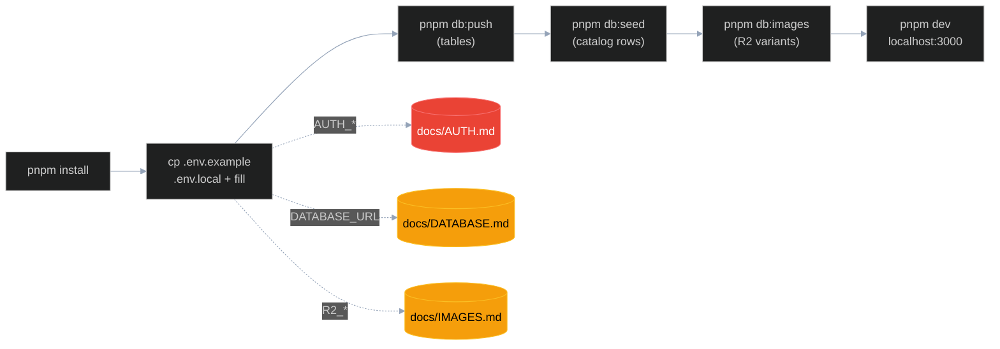
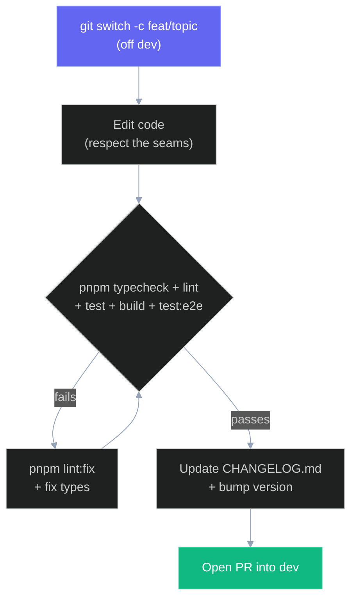

# Local Development

How to get [kalchar.co.in](https://kalchar.co.in/) running on your machine and the conventions a contributor has to follow. This doc covers prerequisites, first-time setup, the full script reference, local-dev gotchas, and the project rules that govern every change. Start at [ARCHITECTURE.md](ARCHITECTURE.md) for the system picture; come here when you are ready to run the app or open a PR.

## Prerequisites

| Tool | Version | Why |
| --- | --- | --- |
| Node | `>=22` | pinned in [package.json](../package.json) `engines.node` |
| pnpm | `10.32.0` | pinned in [package.json](../package.json) `packageManager` -- use Corepack (`corepack enable`) so the exact version is used |
| Git | any recent | branches PR into `dev` (see [Conventions](#conventions)) |

The app builds and serves against three external services. You need credentials for full function, but not all three to start:

| Service | What it backs | Without it |
| --- | --- | --- |
| Neon Postgres | the catalog (`artworks`, `workshops`, `maintainers`) | the data seam has nothing to read -- gallery/work pages are empty. Get a `DATABASE_URL` per [DATABASE.md](DATABASE.md). |
| Cloudflare R2 | artwork image variants | `<picture>` srcsets 404. Get the `R2_*` values per [IMAGES.md](IMAGES.md). |
| Google OAuth | admin sign-in | `/admin` is unreachable. Get `AUTH_GOOGLE_ID` / `AUTH_GOOGLE_SECRET` per [AUTH.md](AUTH.md). |

The public marketing pages (about, workshops, contact, custom-orders) render without any of these, since their copy comes from `data/site.json` through the synchronous `getSite()`, not the DB.

## First-time setup

`.env.local` is gitignored. The contract for what goes in it lives in [.env.example](../.env.example); copy it and fill in real values. Never commit secrets.

```sh
# 1. Use the pinned pnpm and install deps.
corepack enable
pnpm install

# 2. Create your local env file from the template, then fill it in.
cp .env.example .env.local
#   AUTH_SECRET, AUTH_GOOGLE_ID, AUTH_GOOGLE_SECRET  -> docs/AUTH.md
#   DATABASE_URL                                     -> docs/DATABASE.md
#   R2_* and NEXT_PUBLIC_IMAGE_BASE_URL              -> docs/IMAGES.md
#   (NEXT_PUBLIC_IMAGE_BASE_URL is the same value as R2_PUBLIC_BASE_URL,
#    exposed to the client because the gallery is a client component.)

# 3. Create the tables in your Neon database.
pnpm db:push

# 4. Seed the catalog rows from data/artworks.json.
pnpm db:seed

# 5. Upload the image variants from public/artworks/ to R2.
pnpm db:images

# 6. Run the dev server.
pnpm dev          # http://localhost:3000
pnpm dev --port 3001  # alternate when 3000 is occupied; register the matching OAuth callback
```

Steps 3 to 5 are one-time per environment (or when the schema, seed data, or master images change). After the first run, day-to-day work is just `pnpm dev`. `AUTH_SECRET` is generated with `npx auth secret` (noted in [.env.example](../.env.example)); the admin allowlist is not an env var -- it is the `maintainers` table, seeded with the root account and editable from `/admin/maintainers`.



## Scripts reference

Every script from [package.json](../package.json), what it runs, and when you reach for it.

| Script | Runs | When |
| --- | --- | --- |
| `pnpm dev` | `next dev --turbopack` | Day-to-day local server with HMR (Turbopack). The default. |
| `pnpm build` | `next build` | Production build: SSG of the public pages from Neon + the dynamic admin/api routes. Run before a PR to catch build-time failures. |
| `pnpm start` | `next start` | Serve the output of `pnpm build` locally. Rarely needed -- Vercel does this in prod. |
| `pnpm lint` | `biome check` | Lint + format-check (no writes). What CI runs; run it before pushing. |
| `pnpm lint:fix` | `biome check --write` | Apply Biome's safe lint fixes and formatting in place. |
| `pnpm format` | `biome format --write` | Format only (no lint rules), in place. |
| `pnpm typecheck` | `tsc --noEmit` | Strict TypeScript check, no emit. Run before a PR alongside lint. |
| `pnpm test` | `vitest run` | Unit tests for domain helpers, validation, rate limiting, and storage compensation. |
| `pnpm test:e2e` | `playwright test` | Desktop and mobile Chromium checks, including axe accessibility scans. Uses port 3001 by default. |
| `pnpm test:all` | unit + browser suites | Full automated test pass after a production build. |
| `pnpm health` | `node scripts/health-check.mjs` | Check production HTML, sitemap, catalog feed, and logo responses. |
| `pnpm db:push` | `drizzle-kit push` | Push schema directly to a disposable local database only. |
| `pnpm db:generate` | `drizzle-kit generate` | Generate the reviewable SQL migration required for a schema change. |
| `pnpm db:migrate` | `drizzle-kit migrate` | Apply the generated migration files to the database. |
| `pnpm db:seed` | `tsx --env-file=.env.local scripts/migrate-json-to-db.ts` | Seed catalog rows from `data/artworks.json` into Neon. One-time per environment. |
| `pnpm db:images` | `tsx --env-file=.env.local scripts/migrate-images-to-r2.ts` | Generate + upload artwork image variants from `public/artworks/` to R2. One-time per environment. |

The `db:seed` and `db:images` scripts read `.env.local` explicitly via `tsx --env-file`; the rest inherit env the usual Next/Vercel way. See [DATABASE.md](DATABASE.md) for the schema/push details and [IMAGES.md](IMAGES.md) for the variant pipeline.

## Local dev notes

**In-app DevTools panel is off.** [next.config.mjs](../next.config.mjs) sets `devIndicators: false`. The panel first shipped in Next 15.5 where, on Windows + pnpm, its `segment-explorer-node` module drifted out of sync with the React Client Manifest after a hot reload and crashed client-component pages until the dev server was restarted. Kept off as a dev-stability flag; the panel adds nothing here and production builds never include it.

**Trailing slashes.** `trailingSlash: true` keeps the canonical `/work/` URL shape the site has always used, preserving links and SEO from the earlier static era. Author internal links with the trailing slash to match.

**No Next image optimizer.** `images.unoptimized: true`. The gallery serves artwork from Cloudflare R2 through a hand-rolled `<picture>` element ([lib/image-base.ts](../lib/image-base.ts)), not `next/image`, so Next's optimizer is intentionally off. See [IMAGES.md](IMAGES.md) for how the srcset is built.

**Biome 2 is the one tool.** [biome.json](../biome.json) is both formatter and linter, and it runs in CI plus on save. Key settings to write code that passes without a fix pass:

| Setting | Value |
| --- | --- |
| Indent | tabs, width 2 (`formatter.indentStyle: "tab"`) |
| Line width | 100 |
| Line ending | `lf` |
| Quotes | double (JS + JSX), semicolons always, trailing commas `all` |
| JSON | trailing commas `none` |
| Imports | `organizeImports` on (assist), `useImportType` warns -- use `import type` for types |
| Lint base | `recommended` on; `noExplicitAny` warns; `noNonNullAssertion` off |

Biome's `vcs.useIgnoreFile` is on, so `.gitignore`d paths are skipped; `.next`, `out`, `node_modules`, `_opt`, and `pnpm-lock.yaml` are explicitly excluded in `files.includes`.

## Conventions

These are the project rules from [CLAUDE.md](../CLAUDE.md) that gate every contribution. Read them before writing code -- a PR that breaks an architectural seam or a copy rule gets sent back.

**Architecture (the seams).**

- **Catalog reads go through [lib/data.ts](../lib/data.ts) only.** Never query Neon or `import data/*.json` anywhere else. The async getters map DB rows to the UI types. `getSite()` stays synchronous because `app/layout.tsx` consumes it at module top-level where `await` cannot reach.
- **Image URLs come from [lib/image-base.ts](../lib/image-base.ts).** Browser surfaces use the same-origin `ARTWORK_IMAGE_BASE`; external metadata and server operations use the absolute R2 builders.
- **Admin mutations are server actions**: catalog/roster in `app/admin/actions.ts`, events + profile settings in `app/admin/event-actions.ts` (shared helpers in `app/admin/_helpers.ts`). Each one re-checks the maintainer session before touching Neon or R2.
- **URLs come from `lib/site-config.ts`** (`siteConfig.url` / `prodUrl`). One source.
- **500-line file ceiling.** Split before committing -- extract a sub-component, lift styles, or pull data into JSON.
- **Data files live at repo root** (`data/`), not under `src/`.

**Visual / motion.**

- **Mobile-first.** Most traffic is WhatsApp / Instagram link-taps on phones. Design for phone width first, then scale up.
- **Reduced-motion safe.** Handled at the library level via `MotionConfig reducedMotion="user"`, plus an explicit `usePrefersReducedMotion()` gate for anything Motion's config cannot reach (raw `useSpring`, animated SVG `rx/ry`). MEMORY.md "Motion exclusions" is the source of truth for the policy.
- **No raw hex / rgb in components.** Browser-rendered color flows through CSS custom properties. The only exceptions are `data/artworks.json` palette arrays, SVG data URIs, and pre-CSS/server image outputs that import the named constants in `lib/server-brand-colors.ts`.
- **No magic timings.** Use the named tokens (`--duration-fast/base/slow`, `--ease-out-soft/glide/spring`).
- **Consistent corner radius.** `rounded-md` on every surface (cards, panels, fields, buttons, image plates). Pills and the theme toggle stay `rounded-full`. No sharp corners.
- **Section pigment accents.** about=marigold, workshops=pichwai, custom-orders=vermillion, contact=peacock; hero + Selected Work inherit global terracotta. Set via `--section-accent` inline on `<main>` or a `Section` wrapper.

**Copy.**

- **No double-dash glyph in user-facing copy.** Banned in metadata, JSX strings, page bodies, dropdown options, and `data/*.json`. Replace with a comma, period, colon, parentheses, or restructure. Internal code comments, JSDoc, and these docs may keep `--` since they do not ship.
- **No emojis** in user-facing copy or commits unless explicitly asked.
- **Voice** is neutral first-person plural ("we'll get back to you"), not third-person by name. Exception: `data/site.json` artist-voice copy, where the artist speaks in first-person singular and we do not rewrite her words.

**Git workflow.**

- **Branch off `dev`.** Feature branches are `feat/*`, `fix/*`, `chore/*`; they PR into `dev`. `main` is branch-protected.
- **Conventional commits:** `feat`, `fix`, `refactor`, `docs`, `test`, `chore`. Lowercase, imperative, no trailing period.
- **Update [CHANGELOG.md](../CHANGELOG.md) and bump `package.json` `version` on every PR.** Pre-1.0.0: patch (`0.x.Y`) for typo/link/image/new artwork, minor (`0.X.0`) for new section / content-model change / stack swap. Add a real top entry under the chosen version, no `[Unreleased]` placeholder.
- **Never push without explicit per-session approval.** Never force-push `main`, amend published commits, or skip hooks (`--no-verify`). Stage files by name, never `git add .`.

## Making a change

The loop for a typical contribution. The directory map is in [ARCHITECTURE.md](ARCHITECTURE.md#repository-map) -- not duplicated here.



Local verification mirrors CI: lint, typecheck, unit tests, build, and Playwright browser tests. Do not claim a change works on types/lint alone. Run the built app and exercise the actual page or admin flow before opening the PR. See [DEPLOYMENT.md](DEPLOYMENT.md) for what happens after merge.
