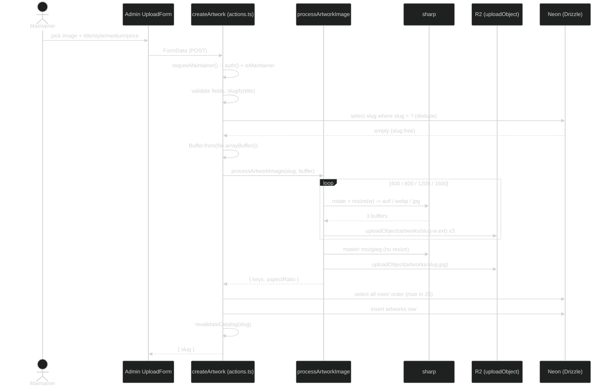
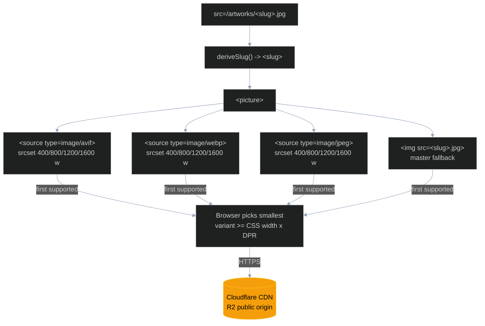
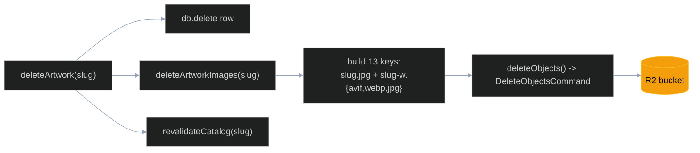

# Images and Storage

How catalog images (artworks, event photos, the artist profile photo) are stored, processed, and served. Masters live in Cloudflare R2; one sharp pipeline (`processImageVariants`, shared by artworks under `artworks/<slug>`, events under `events/<id>/<imageId>`, and the profile photo under `profile/artist`) derives a fixed set of responsive variants on upload; the site serves them through a hand-rolled `<picture>` (`ResponsiveImage`, wrapped by `ArtImage` for artworks) straight off Cloudflare's CDN with no server or DB at request time. This is the image layer of [ARCHITECTURE.md](ARCHITECTURE.md); for the schema that carries the per-row image metadata see [DATABASE.md](DATABASE.md), and for who is allowed to upload see [AUTH.md](AUTH.md).

## Overview

Cloudflare R2 is S3-API-compatible, so [lib/storage/r2.ts](../lib/storage/r2.ts) talks to it with the AWS S3 SDK (`@aws-sdk/client-s3`) pointed at the R2 endpoint. The client (r2.ts:29) is configured with `region: "auto"` and `endpoint: https://<R2_ACCOUNT_ID>.r2.cloudflarestorage.com`. R2 is preferred over S3 for a public image catalog because it has **zero egress fees** -- the gallery streams the same images on every page load, so egress, not storage, is the cost that matters.

Two halves, deliberately split:

- **Write side** -- `r2.ts` holds the access keys and is server-only. It is imported by the admin server actions ([app/admin/actions.ts](../app/admin/actions.ts)) and the `pnpm db:images` migration script, never by a client component. If the credentials are missing it throws at module load (r2.ts:25): `R2 credentials are not set. See .env.example and docs/IMAGES.md.`
- **Read side** -- public objects are served from `R2_PUBLIC_BASE_URL`. The object URL is always `${R2_PUBLIC_BASE_URL}/${key}` (r2.ts:49). The gallery never touches the SDK; it builds plain URLs against [lib/image-base.ts](../lib/image-base.ts).

### Environment variables

| Variable | Side | Used by | Purpose |
| --- | --- | --- | --- |
| `R2_ACCOUNT_ID` | server | r2.ts:18, r2.ts:31 | Builds the `https://<id>.r2.cloudflarestorage.com` endpoint |
| `R2_ACCESS_KEY_ID` | server | r2.ts:19 | S3 credential |
| `R2_SECRET_ACCESS_KEY` | server | r2.ts:20 | S3 credential |
| `R2_BUCKET` | server | r2.ts:22 | Target bucket, defaults to `kalchar-artworks` |
| `R2_PUBLIC_BASE_URL` | server | r2.ts:23, image-base.ts:17 | Public origin for serving objects; server-side fallback for scripts |
| `NEXT_PUBLIC_IMAGE_BASE_URL` | client | image-base.ts:16 | Same value as `R2_PUBLIC_BASE_URL`, shipped to the browser |

`NEXT_PUBLIC_IMAGE_BASE_URL` exists because the gallery [components/gallery/art-image.tsx](../components/gallery/art-image.tsx) is a client component (`"use client"`, art-image.tsx:1), so the base URL must ship in the bundle. It is a public URL, not a secret. It must be set in every environment (Vercel prod + preview, CI, and local `.env.local`). The credentials (`R2_ACCESS_KEY_ID` / `R2_SECRET_ACCESS_KEY`) stay server-only.

### The URL base

[lib/image-base.ts](../lib/image-base.ts) resolves one constant and exports it:

```ts
const r2Base = (
  process.env.NEXT_PUBLIC_IMAGE_BASE_URL ??
  process.env.R2_PUBLIC_BASE_URL ??
  ""
).replace(/\/$/, "");

export const ARTWORK_IMAGE_BASE = `${r2Base}/artworks`;
```

`NEXT_PUBLIC_IMAGE_BASE_URL` wins (browser-readable); `R2_PUBLIC_BASE_URL` is the fallback for server-side scripts that do not load the `NEXT_PUBLIC_` copy. A trailing slash is stripped so `ARTWORK_IMAGE_BASE` is always `<origin>/artworks`. Every variant URL, the lightbox, and OG metadata read from this one constant. All artwork objects live under the single `artworks/` key prefix in the bucket.

## Variant matrix

The variant set is a fixed contract. [lib/storage/process-artwork-image.ts](../lib/storage/process-artwork-image.ts) writes, per artwork slug, AVIF + WebP + JPG at four widths plus one master-width JPG fallback -- **13 objects**, all under `artworks/`:

```text
artworks/<slug>-400.avif   artworks/<slug>-400.webp   artworks/<slug>-400.jpg
artworks/<slug>-800.avif   artworks/<slug>-800.webp   artworks/<slug>-800.jpg
artworks/<slug>-1200.avif  artworks/<slug>-1200.webp  artworks/<slug>-1200.jpg
artworks/<slug>-1600.avif  artworks/<slug>-1600.webp  artworks/<slug>-1600.jpg
artworks/<slug>.jpg        (master-width mozjpeg fallback, the bare )
```

Widths are `[400, 800, 1200, 1600]` (process-artwork-image.ts:17). The same list is duplicated in art-image.tsx:45, so the producer and consumer agree without any per-image bookkeeping in the database -- the row stores only the master filename. The output keys match `ARTWORK_IMAGE_BASE` exactly, which is why a freshly uploaded slug resolves in the gallery with no extra wiring.

### sharp encode options

| Format | Options (process-artwork-image.ts) | Rationale |
| --- | --- | --- |
| AVIF | `quality: 60, effort: 4, chromaSubsampling: "4:2:0"` (line 18) | Smallest modern format; first `<source>` tried |
| WebP | `quality: 72, effort: 4` (line 19) | Mid-tier fallback for browsers without AVIF |
| JPEG | `quality: 82, mozjpeg: true, chromaSubsampling: "4:2:0"` (line 20) | Universal fallback; mozjpeg encoder for better ratio |

Every encode path starts from the source with three normalizing steps before resize:

- `sharp(master, { failOn: "none" })` -- tolerate minor decode warnings rather than throwing on a slightly-off source.
- `.rotate()` -- bake EXIF orientation into the pixels.
- `.withMetadata({ orientation: undefined })` -- strip the orientation tag afterward so a browser does not double-rotate.

The width variants add `.resize({ width: w, withoutEnlargement: true })` (process-artwork-image.ts:46): a source narrower than a target width is left at its natural size rather than upscaled, so a 1000px master never produces a blurry 1600px variant. The master JPG (process-artwork-image.ts:58) is encoded with the same `JPEG_OPTS` but no resize, preserving full source width.

`processArtworkImage(slug, master)` returns `ProcessedImage` -- `{ keys, aspectRatio }`. `aspectRatio` is `meta.width / meta.height` from the source metadata, falling back to `0.75` if either dimension is missing (process-artwork-image.ts:33). The caller stores it on the artwork row so the gallery can reserve layout space before the image decodes (no layout shift). `keys` is the list of all written object keys, for rollback or bookkeeping.

## Upload pipeline

A maintainer uploading a new piece runs `createArtwork` (actions.ts:88), a server action taking `FormData`. It re-checks auth (`requireMaintainer`, actions.ts:20) even though [proxy.ts](../proxy.ts) already gates `/admin` -- defense in depth, since a server action can be invoked directly. It validates that `title`, `style`, `medium`, and a non-empty image `File` are present, slugifies the title, and rejects a slug that already exists in the DB before doing any image work.



Notable mechanics in `createArtwork`:

- **Buffer**: `Buffer.from(await file.arrayBuffer())` (actions.ts:108) turns the uploaded `File` into the buffer `processArtworkImage` expects. Images are processed entirely in memory; nothing is written to local disk.
- **Order**: it reads every row's `order`, takes `Math.max(..., 0) + 1` (actions.ts:113-114) so a new piece sorts to the end.
- **Inserted row** (actions.ts:116): `image` is set to `${slug}.jpg` (the master filename only -- variants are derived, never stored per-row), `aspectRatio` comes from the pipeline, `featured: false`.
- **Status from price**: if a parseable `priceInr` is present the row is inserted `status: "available"`, otherwise `status: "archive"` (actions.ts:127-128). Price drives availability.
- **Revalidation**: `revalidateCatalog(slug)` (actions.ts:37) calls `revalidatePath` for `/`, `/work`, `/admin`, and `/work/<slug>`, so the statically generated public pages regenerate with the new piece.

If `processArtworkImage` uploads some variants and then the DB insert fails, the orphaned R2 objects are not auto-rolled-back; the returned `keys` exist so a future cleanup can target them, but the action does not currently use them for compensation.

## Serving flow

The gallery renders a native `<picture>` per artwork ([components/gallery/art-image.tsx](../components/gallery/art-image.tsx)). It derives the slug from the master `src` (`deriveSlug`, art-image.tsx:47 -- strips the directory and extension), builds three `srcset`s from `ARTWORK_IMAGE_BASE`, and lets the browser pick.



How the browser resolves it:

1. It walks the `<source>` list top-down and takes the **first format it supports**: AVIF, then WebP, then JPEG (art-image.tsx:106-108). A browser with no `<source>`/`srcset` support at all falls back to the bare `` -- the master `<slug>.jpg` (art-image.tsx:111, `jpegFallback`).
2. Within the chosen `<source>`, the `sizes` hint plus the width-descriptor `srcset` (built by `buildSrcset`, art-image.tsx:53) let the browser pick the **smallest variant whose width covers the rendered CSS width times `devicePixelRatio`**. `sizes` is passed by each consumer to mirror its grid widths (for example `(min-width: 1024px) 33vw, 50vw`).
3. The selected object streams directly from the Cloudflare CDN over the R2 public origin. There is no server hop and no DB read at request time -- public pages are pre-rendered (see the rendering model in [ARCHITECTURE.md](ARCHITECTURE.md)), and images are just static URLs.

### Resilience and settle

- **onError soft placeholder**: if the `` 404s (a missing variant, a stale slug), `onError` flips `failed` state (art-image.tsx:117) and the component renders a `role="img"` placeholder with an `ImageOff` icon (art-image.tsx:70-80) so the browser's broken-image glyph never reaches a visitor. The `alt` is preserved on the placeholder for accessibility.
- **Decode settle**: non-priority images that are not in reduced-motion mode start at `opacity: 0`, `blur(2px)`, `scale(1.02)` (art-image.tsx:101) and transition in on `onLoad` (fade + unblur + un-scale). A `ref` callback (art-image.tsx:93) marks already-cached images loaded so they do not stay stuck hidden. The hidden state is an **inline** `opacity: 0` (not a class) so the no-JS `<noscript>` net in `app/layout.tsx` can unhide it for crawlers and JS-disabled visitors. `priority` images (LCP-critical) skip the settle and fetch eager / `fetchPriority="high"`.

### Why hand-rolled `<picture>`, not `next/image`

The gallery is a client component, images come from a known R2 origin in a fixed variant set, and `next.config.mjs` sets `images.unoptimized: true`. A hand-rolled `<picture>` gives responsive AVIF/WebP/JPG with **zero runtime image-optimizer dependency** -- no Next image optimizer in the request path, no per-request transform cost. The variant work happens once, at upload time, in the sharp pipeline.

## Delete and bulk migration

### Delete

`deleteArtwork(slug)` (actions.ts:136) removes the DB row first, then calls `deleteArtworkImages(slug)` (process-artwork-image.ts:69) to drop all 13 R2 objects, then revalidates. `deleteArtworkImages` reconstructs the full key list (master `<slug>.jpg` plus the three formats at each of the four widths) and hands it to `deleteObjects` (r2.ts:53), which issues one `DeleteObjectsCommand` batch and is a no-op on an empty list.



### Bulk seed

To populate R2 from the master JPGs checked into the repo, run:

```sh
# Generate + upload all variants for every master in public/artworks/
pnpm db:images
```

[scripts/migrate-images-to-r2.ts](../scripts/migrate-images-to-r2.ts) reads `public/artworks/` (`MASTER_DIR`, migrate-images-to-r2.ts:23), filters to `.jpg` files, derives the slug from each filename, and runs the **same** `processArtworkImage` pipeline the admin upload uses -- so a bulk-seeded image is byte-for-byte equivalent to an admin-uploaded one. It runs a bounded worker pool of `POOL = 4` (migrate-images-to-r2.ts:44): each master fans out to ~13 sharp encodes plus uploads, so the small outer pool keeps it from opening hundreds of sockets at once. The script is idempotent -- re-running regenerates and overwrites the same keys.

`public/artworks/` is the **regenerate source**, not a runtime asset. Those masters are never served to visitors (visitors get R2 variants); they exist so the full variant set can be rebuilt from scratch -- for example after a tuning change to the sharp options, or if the bucket is recreated.

```sh
# Related catalog seed (rows, not images) -- see DATABASE.md
pnpm db:seed
```

The full setup order (env vars, then seed rows, then seed images) and where these scripts fit in deploy lives in [DEPLOYMENT.md](DEPLOYMENT.md) and [DEVELOPMENT.md](DEVELOPMENT.md).
